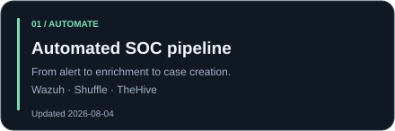
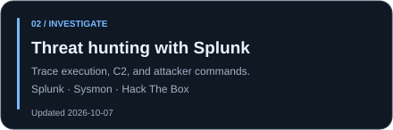
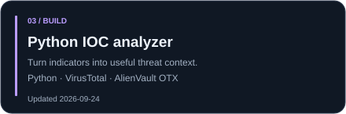
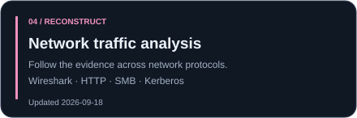

# Brandon Chaney
**IT foundation. Security focus. Evidence behind the work.**

I support users and infrastructure, investigate security events, and build tools that make the next investigation easier.

[Portfolio](https://brandonchaney.dev) · [All repositories](https://github.com/bran-dot-flake?tab=repositories)

### Tools I work with

**Investigate:** Splunk · Sentinel · Wireshark · Sysmon &nbsp; **Automate:** Wazuh · Shuffle · TheHive

### Selected work

 

Behind the dashboard

Updated daily by GitHub Actions. Code and files are measured from current default branches of public, non-fork, non-archived repositories; this profile repository is excluded. Code uses cloc and excludes prose, data/config formats, and common build/vendor folders. Files include all tracked files, including images and documentation. Code totals describe repository contents, not sole authorship.

Commits cover the last 90 days on those default branches, across all authors, excluding identifiable bots and deduplicating hashes. The line shows 13 weekly buckets (the oldest is partial); it is not GitHub's contribution calendar. The specialization network counts repository topics, not proficiency. Skills and featured-project descriptions are deliberately curated.

